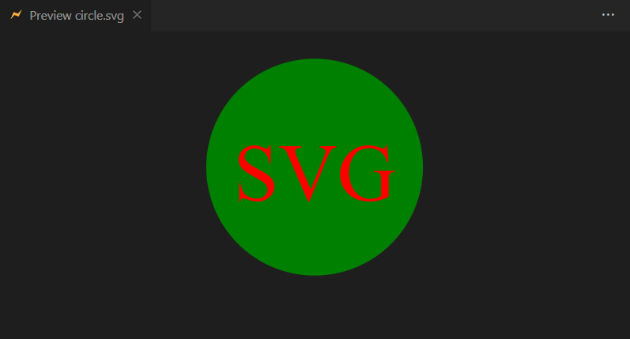
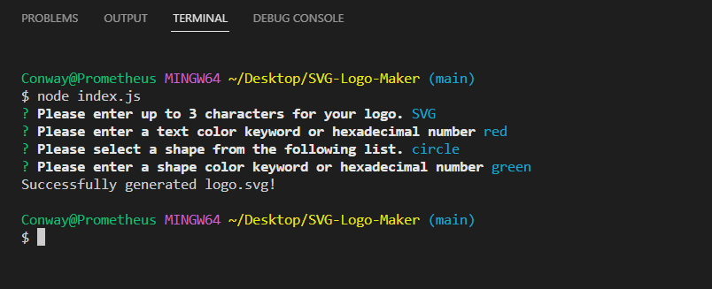

# SVG Logo maker

    
## Table of Contents
* [Description](#description)
* [Built-With](#built-with)
* [Demo](#demo)
* [Installation](#installation)
* [Usage](#usage)
* [License](#license)
* [Contributing](#contributing)
* [Tests](#tests)
* [Questions](#questions)

## Description
    
This is a command-line application that dynamically generates an SVG Logo File from a user’s input. 

## Built-With

This app runs in the terminal and features dynamically updated code powered by Node.js.

  * Javascript
  * Node.js
  * Inquirer
  * Jest

## Demo

The following link includes a video demo of the application's functionality:

[SVG Logo Video Demo](https://drive.google.com/file/d/1Lwv3wXkxYVoPzzEbPo2FHyPDPoN7oGto/view)

The following image displays a preview of a generated SVG Logo.

The following image demonstrates a mock-up example of what a user would view in the terminal when using this application.

## Installation

The user will first need to download the Node.js application onto their computer and then install the required Inquirer package by typing `npm i inquirer` into the terminal.

## Usage

In order to run the SVG Logo generator, the user will need to type `node index.js` to launch a series of questions. Once all the questions have been answered, the responses will be saved/written to a “logo.svg” file.

## License
        
    MIT

## Contributing

Currently not accepting contributions to this project.

## Tests

In order to test the functionality of this application, a user may also download the Jest package by typing `npm install --save-dev jest` into their terminal and then running `npm run test`.

## Questions

If there are additional questions, please reach out to me here: 

* GitHub: https://github.com/Carolinapalacios95
* Email: carolina.palacios1995@gmail.com
